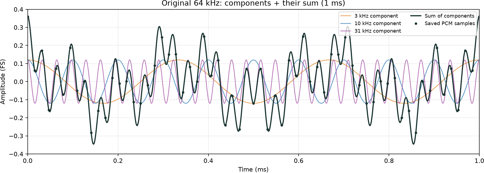
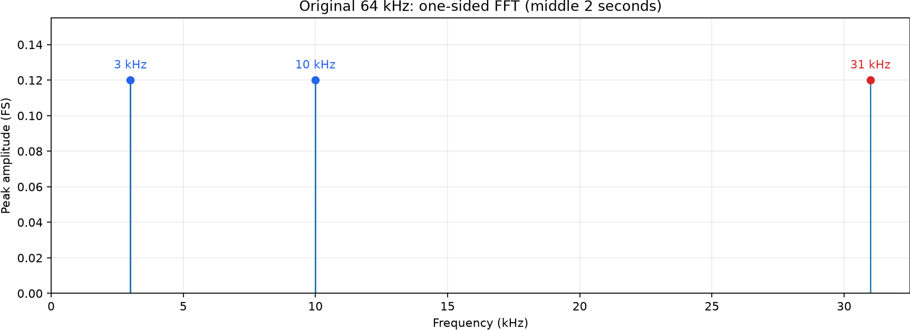
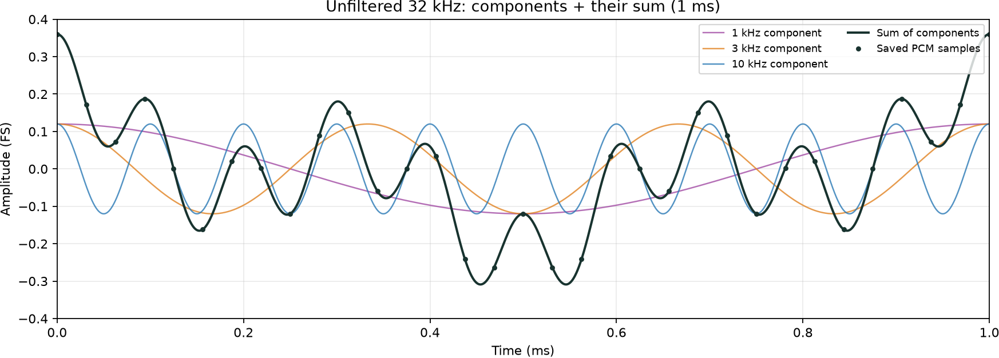
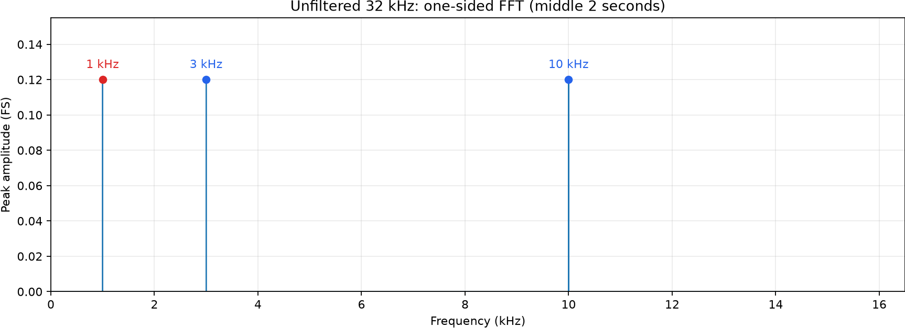
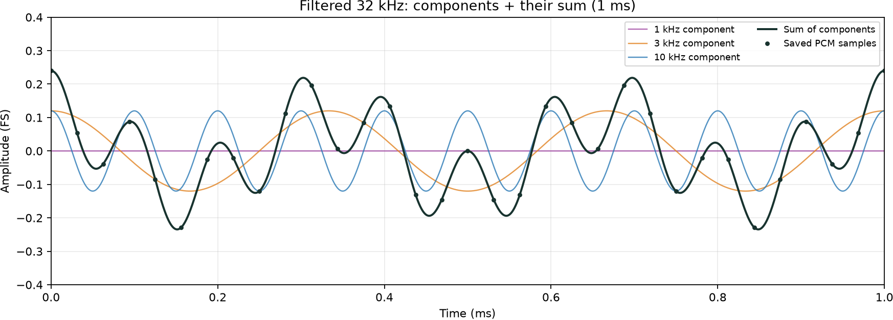
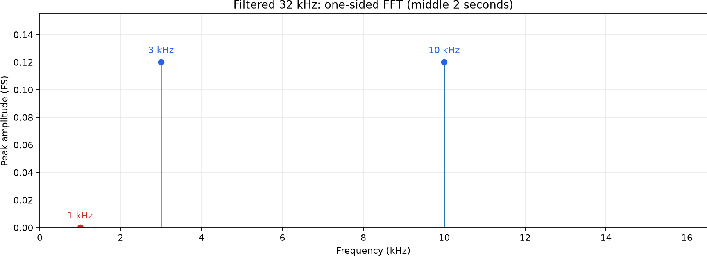

# DSP Experiments for Embedded Developers

A reproducible portfolio pipeline: **run a Jupyter notebook locally, verify its
results, then use those results to write a reader-friendly blog.**

## Results: 64 → 32 kHz downsampling

The main experiment is a four-second synthetic PCM16 recording containing three
equally strong tones: **3, 10 and 31 kHz**, each at 0.12 full-scale amplitude.
We compare keeping alternate samples directly with low-pass filtering first.
Both outputs are saved at 32 kHz, with the original duration and a shared amplitude
scale. This README presents the saved-sample analysis, without audio players.

### Original: 64 kHz

The coloured component waves add together to form the dark waveform. Dots mark
the actual saved PCM samples. At the original rate, all three tones fit below the
32 kHz Nyquist limit.





### Skip every other sample: 32 kHz, no filter

The new Nyquist limit is 16 kHz. The original 31 kHz tone now appears at
**1 kHz: |31 − 32| = 1 kHz**. Correct playback metadata cannot undo this alias.
The 3 and 10 kHz tones stay at their original frequencies.





### Filter first, then skip samples: 32 kHz

A 129-tap Hamming-window FIR low-pass filter, with a nominal cutoff of 14 kHz,
attenuates the 31 kHz component before samples are discarded. The resulting
1 kHz alias is reduced by **69.34 dB** relative to the unfiltered output.
The 3 and 10 kHz tones remain, with measured gain changes below 0.005 dB.
This causal filter adds a 1 ms group delay; it does not preserve the removed
high-frequency content.





### Measured comparison

| Measurement | Original | Skip samples | Filter first |
|---|---:|---:|---:|
| Sample rate | 64 kHz | 32 kHz | 32 kHz |
| Duration | 4 s | 4 s | 4 s |
| Dominant FFT peaks | 3, 10, 31 kHz | 1, 3, 10 kHz | 3, 10 kHz |
| 1 kHz amplitude (full scale) | 0.000000407 | 0.120002 | 0.000040935 |

**Takeaway:** limit bandwidth before throwing samples away. Fewer PCM samples
save storage, but sample dropping alone is not safe resampling or an audio codec.

These plots and measurements come from
[the executed notebook](2_downsample/code/01_pcm_aliasing_walkthrough.ipynb) and
[its verified results manifest](2_downsample/output/results.json).
The waveform views use the same 1 ms window and amplitude scale; filtered output
has the delay noted above. FFTs analyze the saved WAV samples, not speaker output.
Ordinary speakers cannot reliably reproduce the original 31 kHz component.
This is a desktop simulation, not a microphone or MCU measurement.

## Repository layout

| Experiment | Purpose |
|---|---|
| [1 · Audio demo](1_demo_audio/README.md) | Original two-case audio demo and early learning history |
| [2 · Downsampling](2_downsample/README.md) | Notebook → verified artifacts → blog, including the filtered reference |

Each experiment keeps its input, code and output together. Git and the venv are
at the repository root. Use Python 3.12+; verified with Python 3.14.7.

## Setup

Run from the repository root:

```powershell
python -m venv .venv
.\.venv\Scripts\python.exe -m pip install -r 2_downsample/code/requirements.txt
.\.venv\Scripts\python.exe -m ipykernel install --prefix .venv --name pcm-aliasing --display-name "Python (PCM Aliasing Lab)"
```

An existing environment may have a different name; adjust the executable path.
On macOS/Linux, use .venv/bin/python instead of the Windows executable path.

## Step 1 — Run and verify the notebook

```powershell
.\.venv\Scripts\python.exe -m jupyter nbconvert --to notebook --execute --inplace --ExecutePreprocessor.timeout=120 --ExecutePreprocessor.kernel_name=pcm-aliasing 2_downsample/code/01_pcm_aliasing_walkthrough.ipynb
```

The notebook creates PCM WAVs, plots and output/results.json within 2_downsample.
The results manifest is written only after numerical checks pass.

## Step 2 — Build the blog from results

```powershell
.\.venv\Scripts\python.exe 2_downsample/code/build_blog.py
```

The builder does not run the notebook or compute DSP. It checks the manifest,
artifact hashes and notebook code hash, then renders output/blog.html.
Missing or changed results produce an error rather than replacement data.

## Preview and tests

```powershell
.\.venv\Scripts\python.exe -m http.server 8000 --bind 127.0.0.1 --directory 2_downsample
```

Visit http://127.0.0.1:8000/output/blog.html. Serve the experiment directory so
links to input audio and source work.

```powershell
.\.venv\Scripts\python.exe -m unittest discover -s 2_downsample/code/tests -v
```

The GitHub workflow executes both experiments, tests the pipeline and builds the
blog from verified notebook results.

Source: https://github.com/ch-binh/SIM-Aliasing-in-audio-down-sampling

Reader-friendly article:
https://ch-binh.github.io/my-portfolio/blog/dropping-audio-samples-aliasing/

To link the standalone blog to its notebook, use build_blog.py --source-url with
the notebook's GitHub URL. The portfolio presents verified results; all DSP code
stays in this repository.

The original experiment uses synthetic tones. A companion notebook uses a real
sampled piano note with preserved source attribution. Neither is an MCU benchmark.
See 2_downsample/README.md for the separate piano execution and blog-build steps.
